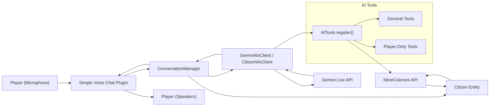
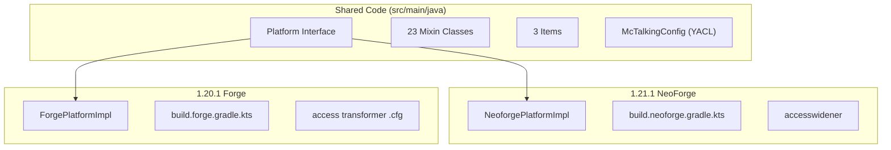

# Architecture

## Data Flow

## Major Subsystems

| Subsystem | Package | Purpose |
|-----------|---------|---------|
| **Entrypoints** | `me.sshcrack.mc_talking` | `McTalking` (common init), `McTalkingClient` (client), `McTalkingVoicechatPlugin` (voice chat) |
| **Conversation Manager** | `.conversations` | Central orchestrator for all conversations, slot management, cooldowns |
| **Config** | `.config` | YACL-based configuration with API/General/Citizens categories |
| **Gemini Client** | `.manager` | `GeminiWsClient`, `CitizenWsClient` — WebSocket clients for the Gemini Live API |
| **Prompt System** | `.api.prompt`, `.manager` | Prompt view/provider SPI for constructing AI prompts |
| **AI Tools** | `.manager.tools` | 15+ function-calling tools the AI can invoke during conversations |
| **Memory** | `.conversations.memory` | Conversation memory, compaction, relationship tracking |
| **Services** | `.handler`, `.rumor`, `.broadcast`, `.pregen` | Rumor mill, broadcast, pregeneration, urgent contact |

## Multi-Loader Architecture

## Mod Initialization

1. **`McTalking` constructor** — Called by mod loader
2. `AITools.register()` — Registers all AI function-calling tools
3. `McTalkingConfig.loadConfig()` — Loads YACL config
4. `ModItems.register()` — Registers 3 items via DeferredRegister
5. Event bus registration — Server event handlers, network payloads
6. `onCommonSetup` — `ColonyEventSubscriber.register()` for MineColonies hooks

## Sub-Pages

- [**Prompt System**](prompt-system.md) — How AI prompts are constructed
- [**AI Tools**](ai-tools.md) — Function-calling tools reference
- [**Voice Chat Integration**](voice-chat.md) — Simple Voice Chat integration
- [**Platform Abstraction**](platform-abstraction.md) — Multi-loader architecture
