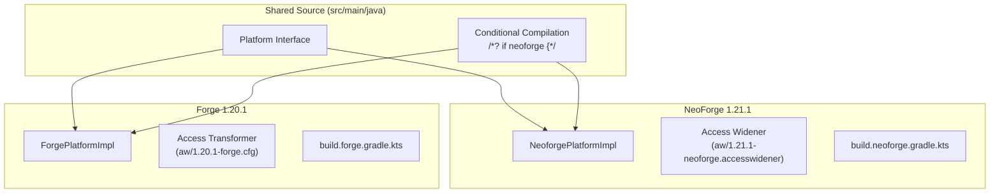

# Platform Abstraction

The mod supports **NeoForge (1.21.1)** and **Forge (1.20.1)** using a platform abstraction layer managed by **Stonecutter**.

## Architecture



## Key Differences

| Aspect | NeoForge (1.21.1) | Forge (1.20.1) |
|--------|-------------------|----------------|
| Mod constructor | `McTalking(IEventBus, ModContainer)` | `McTalking()` |
| Config screen | `IConfigScreenFactory` | `ConfigScreenHandler.ConfigScreenFactory` |
| Event bus | `NeoForge.EVENT_BUS` | `MinecraftForge.EVENT_BUS` |
| Item NBT | `DataComponents.CUSTOM_DATA` | `CompoundTag` directly |
| Client init | Separate `@Mod` instance | `@Mod.EventBusSubscriber` (static) |
| Registry | `BuiltInRegistries` | `ForgeRegistries` |

## Platform Interface

The `Platform` interface defines loader-agnostic methods that each loader implements:

- `NeoforgePlatformImpl` — NeoForge implementation
- `ForgePlatformImpl` — Forge implementation

## Stonecutter Conditional Compilation

The project uses Stonecutter `/*? if neoforge {*/` / `/*? if forge {*/` comments throughout shared code:

```java
// This runs on both loaders
/*? if neoforge {*/
// NeoForge-specific code
/*? } else {*/
// Forge-specific code
/*? } */
```

## Build System

- **Active version**: Managed in `.sc_active_version` (auto-managed by Stonecutter, never commit manually).
- **Version switching**: `./gradlew stonecutter`.
- **Build scripts**: `build.neoforge.gradle.kts` / `build.forge.gradle.kts`.
- **Custom plugin**: `mod-platform` in `build-logic/`.
- **Access transformers**: Version-specific files in `src/main/resources/aw/`.

## Mixin Approach

All 23 mixin classes live in the `me.sshcrack.mc_talking.mixin` package. Every class in that package MUST be a mixin or accessor. Mixin correctness is verified via the mixin smoke test (`scripts/test-mixin-smoke.sh`).
