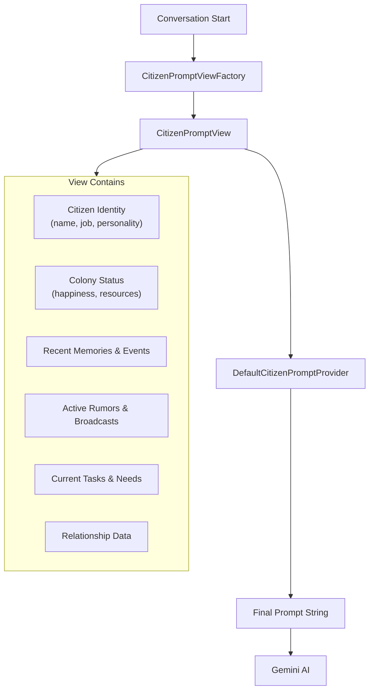

# Prompt System

The prompt system constructs the context that shapes each citizen's AI responses. It follows a view/provider architecture with a customization SPI.

## Prompt Construction Flow



## Prompt Sections

The final prompt includes:

- **Citizen Identity** - Name, job title, personality archetype description.
- **Colony Status** - Overall colony happiness, resource levels, building status.
- **Recent Memories** - Past conversations, significant events, learned facts.
- **Active Rumors and Broadcasts** - Information from the rumor mill and broadcast system.
- **Current Tasks and Needs** - What the citizen is doing and what they need.
- **Relationship Data** - Feelings toward the player and other citizens.

## SPI for Customization

The `api/prompt` package defines a service provider interface for custom prompt generation:

| Interface/Class | Purpose |
|-----------------|---------|
| `CitizenPromptProvider` | Implement to customize how prompts are generated |
| `CitizenPromptService` | Registry where custom providers are registered |
| `CitizenPromptView` | Data object passed to providers with full context |
| View sub-package | Component view objects for each prompt section |

### Custom Provider Example

```java
public class MyCustomProvider implements CitizenPromptProvider {
 @Override
 public String generatePrompt(CitizenPromptView view) {
 // Build a custom prompt from the view data
 }
}
```

## Key Source Files

| File | Purpose |
|------|---------|
| `CitizenPromptViewFactory.java` | Builds the `CitizenPromptView` from citizen data |
| `DefaultCitizenPromptProvider.java` | Default prompt generation logic |
| `AIStateDescriber.java` | Describes citizen state for prompt context |
