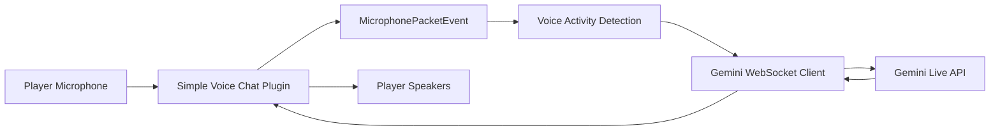

# Voice Chat Integration

The mod integrates with **Simple Voice Chat** to handle all audio input and output.

## Voice Flow

## Integration Points

| Component | File | Role |
|-----------|------|------|
| Voice Chat Plugin | `McTalkingVoicechatPlugin.java` | Registers with Simple Voice Chat, handles events |
| Audio Provider | `AudioProvider.java` | Processes audio streaming |
| Entity Audio | `CitizenEntityAudioProvider.java` | Routes citizen audio to voice chat |

## Events

| Event | Handler | Purpose |
|-------|---------|---------|
| `MicrophonePacketEvent` | `handleMicPacket` | Captures player microphone input, forwards to active Gemini WebSocket client |
| `VoicechatServerStartedEvent` | `onServerStarted` | Stores Voicechat API reference, registers volume categories, starts silence detection |
| `VoicechatServerStoppedEvent` | `onStop` | Shuts down memory generators and executor |

## Volume Categories

Two volume categories control audio levels:

| Category | Purpose |
|----------|---------|
| `ptc_dialog` | Player-to-citizen conversation audio |
| `ctc_dialog` | Citizen-to-citizen conversation audio |

## Audio Processing

- **Voice Activity Detection**: Uses opus packet size heuristics.
- **Silence Detection**: Periodic executor generates randomized ambient noise (Gaussian, amplitude ~5.0) during silence.
- **Whisper Support**: Citizens can use whisper volume (`citizenVoiceWhisper` config).
- **Audio Distance**: Controlled by `citizenVoiceDistance` config (0 = use default).

## Key Config Options

| Key | Default | Description |
|-----|---------|-------------|
| `citizenVoiceWhisper` | `true` | Citizens whisper when talking |
| `citizenVoiceDistance` | `0` | Max audio distance (0 = default) |
