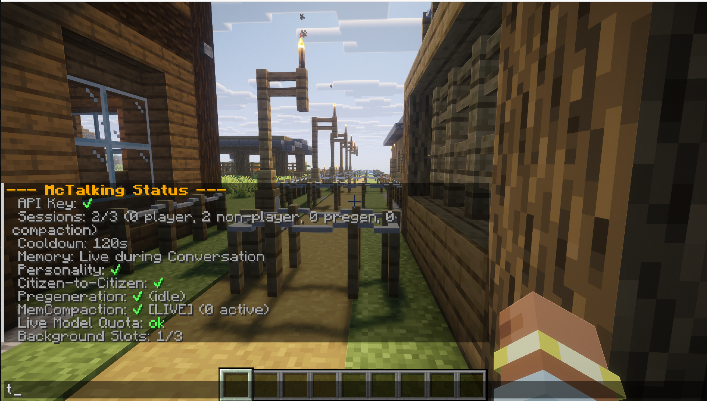
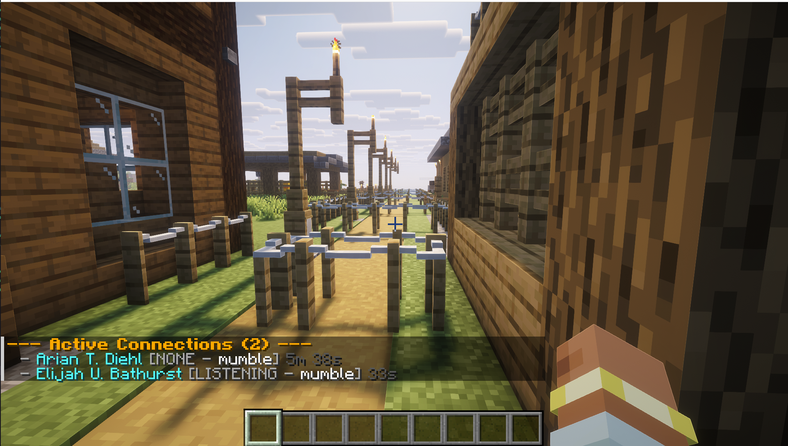

# Commands

!!! warning "Permission Required"
 All commands require **OP level 2** permission.

---

## Root Command

**`/talking_colonists`** — Shows an overview of mod status including API key status, active sessions, config toggles, and cooldowns.

!!! tip "Quick health check"
 This is the first command to run if something isn't working — it tells you if the API key is set and how many sessions are active.

---

## Subcommands

 <code>/talking_colonists status</code> — Detailed system status

Displays:

- API key status (set or empty)
- Active session counts (player, non-player, pregeneration, compaction)
- Cooldown state
- Memory mode, personality toggles
- Citizen-to-citizen toggle
- Pregeneration status
- Compaction status
- Live model quota status
- Background slot usage

 <code>/talking_colonists connections</code> — Active connections

Lists all active WebSocket connections with:

- Citizen name
- AI status
- Session type (player/mumble)
- Duration
- Linked player name

 <code>/talking_colonists citizen &lt;target&gt;</code> — Citizen info

Shows detailed information about a specific citizen:

- UUID, colony, job
- Health, saturation
- AI status, personality archetype
- Active session type and duration
- Conversation partner
- Cooldown state
- Child/sick/homeless flags
- Greeting counts

 <code>/talking_colonists memory &lt;target&gt;</code> — Citizen memory

Shows memory contents of a citizen:

- Session token
- Summarized memory
- Facts and events
- Relationships
- Received broadcasts and rumors

 <code>/talking_colonists events [colony_id]</code> — Colony events

Shows recent colony events:

- Last raid time, raid trauma status
- Recent lifecycle events from `ColonyEventBuffer`
- Omitting `colony_id` auto-detects from the player's colony

 <code>/talking_colonists urgent_contact &lt;citizen&gt;</code> — Urgent contact

Triggers the citizen to walk to the player using `UrgentContactHandler`. Must be executed by a player entity.

 <code>/talking_colonists prompt &lt;citizen&gt; &lt;prompt&gt;</code> — Force prompt

Forces a low-priority AI conversation session with a citizen by injecting a custom prompt string. Force-removes their cooldown first.

 <code>/list_tools</code> — List AI tools

Lists all registered AI tool function names with their category (Player/General).

**`/list_tools <tool_name>`** — Shows detailed description and parameter schema for a specific tool.

---

## Error Messages

| Message | Meaning |
|---------|---------|
| `Target must be a MineColonies citizen.` | The target entity is not a valid MineColonies citizen |
| `Command must be executed by a player.` | Only player entities can run this command |
| `No active Gemini connections.` | There are no active WebSocket sessions |
| `No memories stored for this citizen.` | The citizen's memory is empty or disabled |
| `No Gemini API key set.` | The API key is not configured |
