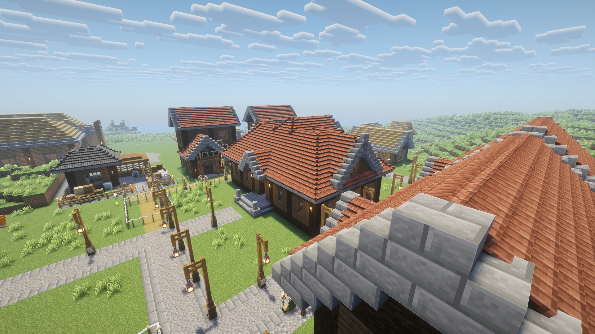

# Features

- [**Conversations**](conversations.md) — Player↔citizen voice chat and autonomous citizen↔citizen conversations
- [**Personalities**](personalities.md) — 15 archetypes that shape each citizen's dialogue and behavior
- [**Rumor Mill**](rumor-mill.md) — Citizens organically share information, creating a living information economy
- [**Broadcast System**](broadcast.md) — Ask citizens to spread messages colony-wide through word-of-mouth
- [**Memory System**](memory.md) — Citizens remember past conversations, events, and relationships
- [**Audio Pregeneration**](pregeneration.md) — Pre-generated greetings for faster response times
- [**Urgent Contact**](urgent-contact.md) — Citizens walk to you with urgent needs or complaints
- [**Mumbling**](mumbling.md) — Ambient citizen mumbling when idle
