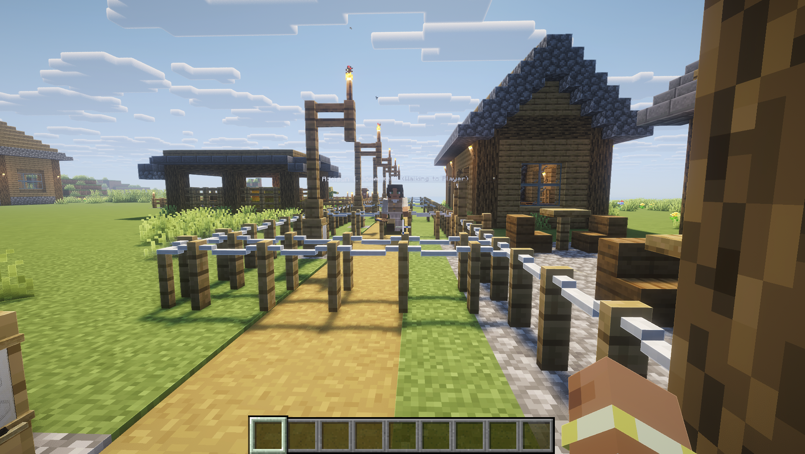

# Urgent Contact

Citizens can proactively seek out players when they have urgent needs, creating a dynamic where citizens come to you with their problems.

!!! tip "A colony that feels alive"
 Imagine walking through your colony and a builder runs up to you saying "We're out of wood!" - that's urgent contact in action.

---

## How It Works

1. **Needs assessment** - Periodically, citizens assess their current situation (happiness, resources, blocked tasks).
2. **Urgency check** - If needs are urgent enough (worker is stuck, missing tools, low happiness), the citizen decides to contact the player.
3. **Walk-to-player** - The citizen walks toward the nearest player using `UrgentContactHandler`.
4. **Conversation start** - When close enough, the citizen automatically starts a conversation to voice their complaint or request.
5. **Cooldown** - A per-player cooldown prevents repeated urgent contacts (`playerUrgentContactCooldownSeconds`).

---

## Casual Greetings

A lighter version of urgent contact: citizens casually greet players they walk past. This creates ambient interaction without requiring full conversations. Handled by `CasualGreetingHandler`.

---

## Key Config Options

| Key | Default | Description |
|-----|---------|-------------|
| `enableCitizenInitiatedContact` | `true` | Citizens proactively speak to players |
| `citizenContactBaseChance` | `0.5` | Base chance per check interval |
| `enableUrgentContactWalkToPlayer` | `true` | Citizens walk to players |
| `urgentContactSearchRange` | `30.0` | Search radius for urgent contacts |
| `blockingTaskUrgencyMultiplier` | `3.0` | Extra urgency when stuck |
| `playerUrgentContactCooldownSeconds` | `60` | Cooldown between contacts per player |
| `citizenCasualGreetingWeight` | `0.1` | Weight for casual greetings |
