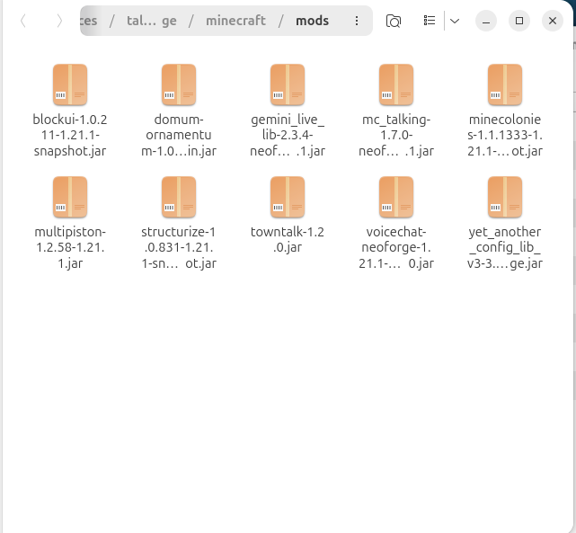
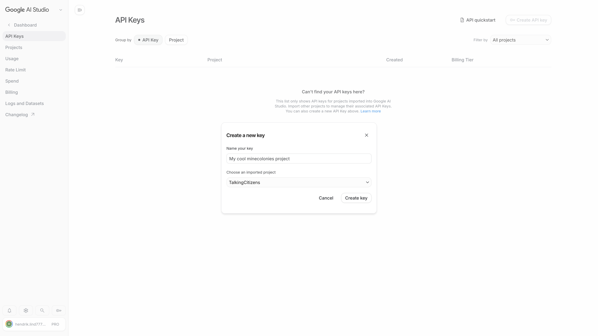
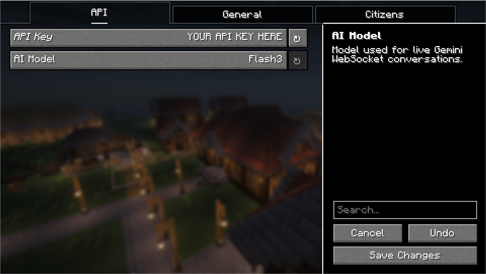

# Setup

Before you start, make sure you have a valid **Google Gemini API key** — the mod won't work without one.

## Installing Dependencies

Install the following mods for your Minecraft version and mod loader:

| Mod | Required For | CurseForge |
|-----|-------------|------------|
| MineColonies | Colony management | [CurseForge](https://www.curseforge.com/minecraft/mc-mods/minecolonies) |
| Simple Voice Chat | Voice chat audio | [CurseForge](https://www.curseforge.com/minecraft/mc-mods/simple-voice-chat) |
| Gemini Live Lib | Gemini Live API | [CurseForge](https://www.curseforge.com/minecraft/mc-mods/gemini-live-lib) |
| YetAnotherConfigLib | Config GUI | [CurseForge](https://www.curseforge.com/minecraft/mc-mods/yacl) |



Place all `.jar` files in your `mods/` folder. On a server, install them on both client and server.

!!! warning "Server Requirement"
 Simple Voice Chat requires a dedicated **UDP port** on your server. See the [Simple Voice Chat wiki](https://modrepo.de/minecraft/voicechat/wiki/server_setup) for details.

---

## Getting a Gemini API Key



1. Visit [Google AI Studio](https://aistudio.google.com/apikey).
2. Click the **Create API Key** button.
3. Copy the generated key.

!!! tip "About Free Tier Limits"
 - **Gemini Flash 3** — Up to **3 concurrent citizens** on the free tier.
 - **Gemini Flash 2.5** — Only **1 concurrent connection** (cheaper but more limited).

---

## Configuration

You can configure the mod in two ways:

### In-Game GUI (Recommended)



1. Launch Minecraft.
2. Open **Mods** → **Talking Citizens** → **Config** from the **main menu** (no need to join a world).
3. The YACL-based GUI organizes settings into three categories: **API**, **General**, and **Citizens**.

!!! tip "No need to restart"
 Changes made via the in-game GUI take effect immediately — no game restart required.

### Direct File Edit

The config file is located at `config/yacl-mc_talking.json5` (JSON5 format).

The file contains many more fields beyond what's shown below — this is only the minimal snippet to get started:

```json5
{
 "api": {
 "geminiApiKey": "YOUR_API_KEY_HERE"
 },
 "general": {
 "language": "en-US"
 }
}
```

Open the full file in a text editor to see all available settings.

### Setting Your Language

Set the `language` field to your preferred [language code](https://ai.google.dev/gemini-api/docs/live-api/capabilities#supported-languages) (default: `en-US`). This controls the language the AI speaks.

---

## Verifying Installation

Check that the mod loaded successfully:

- [ ] Verify the config file exists at `config/yacl-mc_talking.json5`.
- [ ] Craft a Citizen Communication Device and try left-clicking a citizen.

---

## Multiplayer Notes

- The mod must be installed on **both client and server**.
- Simple Voice Chat requires a dedicated UDP port on the server.
- See the [Simple Voice Chat wiki](https://modrepo.de/minecraft/voicechat/wiki/server_setup) for server setup.

!!! bug "Troubleshooting"
 If citizens don't respond, verify your API key is set and ensure Simple Voice Chat is running on the correct port.
