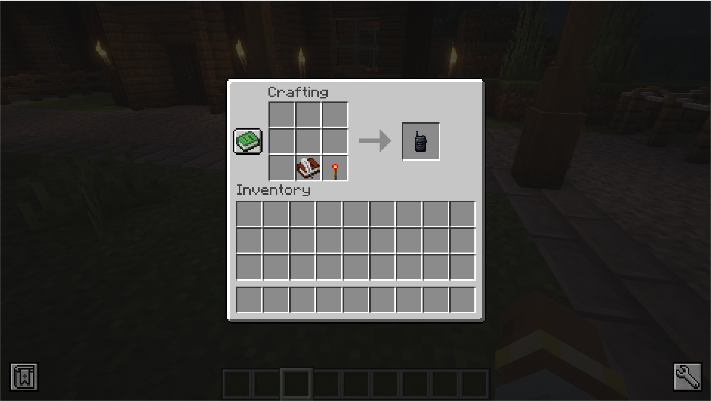
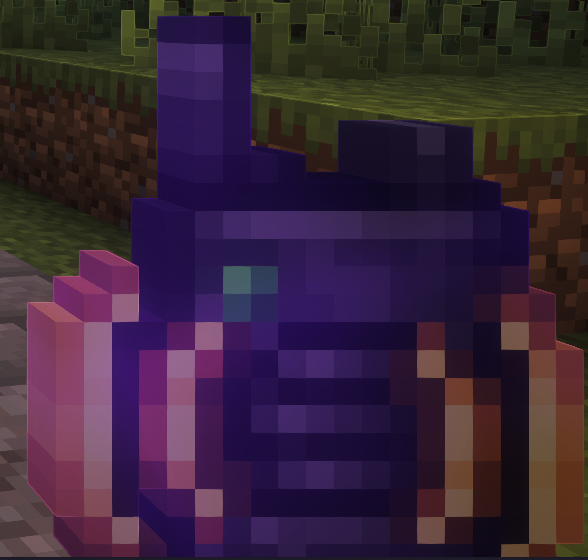
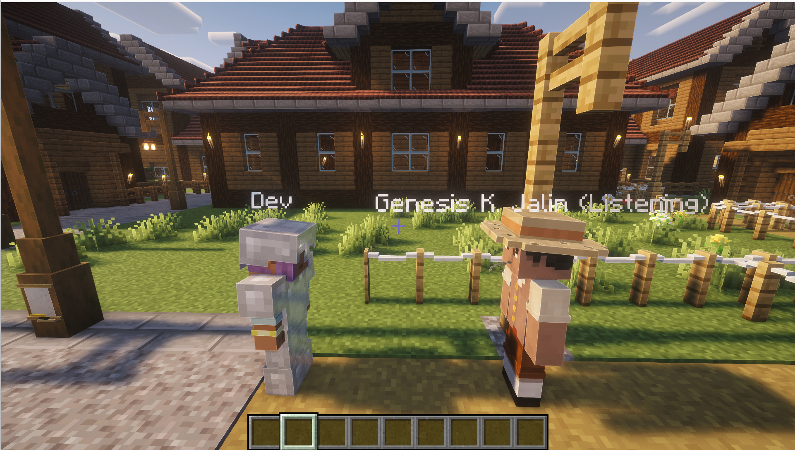

# Usage

## Items

### Citizen Communication Device

The primary item for talking to citizens.

**Recipe:** Book & Quill + Redstone Torch

| Action | Result |
|--------|--------|
| **Left-click** a citizen | Start a voice conversation |
| Press voice chat key | Speak (hold to talk, release to listen) |
| Device glow | Indicates active conversation |

The citizen's name tag shows an AI status indicator:

!!! info "Status indicators"
 | Status | Meaning |
 |--------|---------|
 | `(Connecting)` | Establishing WebSocket connection |
 | `(Thinking)` | AI is processing your input |
 | `(Listening)` | Awaiting your next words |
 | `(Talking)` | AI is speaking back |
 | `(In conversation)` | Chatting with another citizen |
 | `(Walking to Player)` | Citizen is walking toward you |
 | `(Quota exceeded)` | API quota reached |
 | `(Error)` | Connection error |

### Mumbling Trigger Device

Makes citizens mumble to themselves when idle, creating ambient life.

**Usage:** Left-click a citizen to trigger ambient mumbling.

### Conversation Creator Device

Starts autonomous conversations between citizens.

| Step | Action |
|------|--------|
| 1 | Left-click citizens to add them to the participant set |
| 2 | Right-click (use) to start a conversation between all selected citizens |
| 3 | Drop the item to clear the participant set |

---

## Conversation Flow

| Phase | What happens |
|-------|-------------|
| **Initiation** | Left-click a citizen with the Communication Device. The citizen greets you based on their personality. |
| **Speaking** | The citizen can discuss their job, colony status, unmet needs, share rumors, or talk about recent events. |
| **Citizen Actions** | During conversation, the AI can invoke tools to describe surroundings, show inventory, recommend jobs, record relationships, initiate broadcasts, drop items, or leave the colony. |
| **Ending** | The conversation ends when you walk away (beyond the max conversation distance) or when the citizen naturally concludes. |

!!! tip "Player tools vs general tools"
 **Drop item** and **Leave colony** are only available in player-initiated conversations — the AI won't use them autonomously during citizen-to-citizen chats.

---

## Citizen-to-Citizen Conversations

When enabled, citizens autonomously start conversations with each other when nearby. They share rumors, discuss colony events, and gossip. This creates a living, breathing colony where information spreads organically.

!!! example "See it in action"
 Watch two citizens with status `(In conversation)` standing close together — they're having an autonomous conversation about colony life.

---

## AI Status Indicators

The citizen's name tag shows their current AI status in gray parentheses:

| Active | Busy | Error |
|----------------------|---------------------|-------------------|
| `(Connecting)` | `(In conversation)` | `(Error)` |
| `(Thinking)` | `(Quota exceeded)` | |
| `(Listening)` | | |
| `(Talking)` | | |
| `(Walking to Player)` | | |

---

## Multiplayer

Multiple players can have conversations simultaneously, up to the configured `maxConcurrentAgents` limit. Player conversations have priority and can evict lower-priority sessions (mumbling, citizen-to-citizen).

---

## Free Tier Limits

| Model | Concurrent Connections |
|-------|----------------------|
| **Gemini Flash 3** | Up to **3** concurrent |
| **Gemini Flash 2.5** | **1** concurrent |
