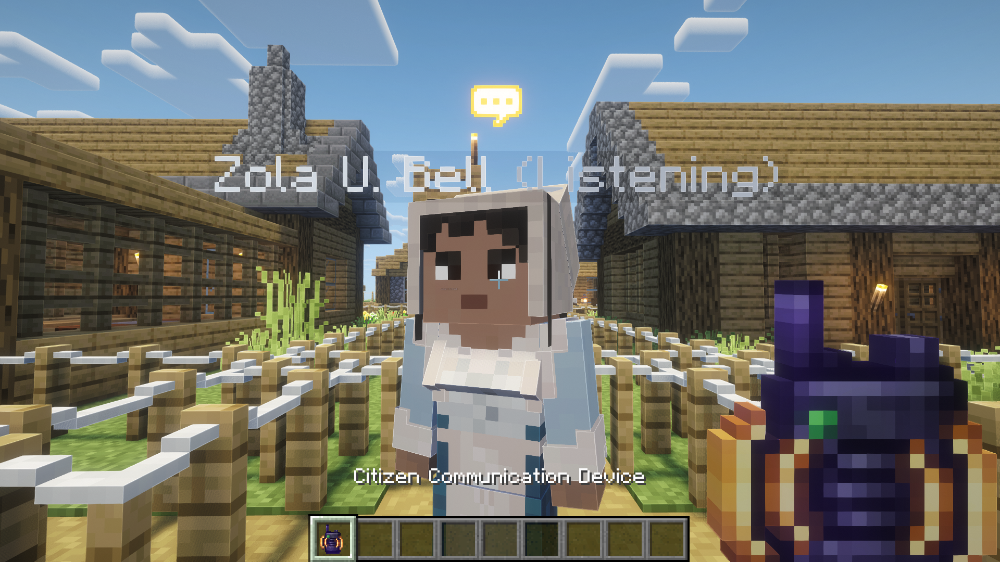

# MineColonies Talking Citizens

<figure markdown="span">
 { width="128" }
</figure>

**Interactive voice chat with your MineColonies citizens via Google Gemini AI.**

Talk to your MineColonies citizens using natural voice conversations powered by Google Gemini AI. Each citizen has a unique personality, remembers past interactions, and reacts to colony events — creating a living, breathing colony.

---

## Features

| | Feature | Description |
|---|---------|-------------|
| | **Voice Chat with Citizens** | Use the Citizen Communication Device and your microphone to hold real-time conversations with any MineColonies citizen. |
| | **15 Personality Archetypes** | Citizens can be optimistic, grumpy, dramatic, philosophical, and more. |
| | **Citizen-to-Citizen Conversations** | Watch your citizens chat with each other, share rumors, and discuss colony life. |
| | **Rumor Mill** | Information spreads organically between citizens, creating a living information economy. |
| | **Broadcast System** | Ask citizens to spread messages colony-wide through word-of-mouth propagation. |
| | **Memory System** | Citizens remember past conversations, events, and relationships. |
| | **Audio Pregeneration** | Pre-generated greetings for faster response times when passing citizens. |
| | **Urgent Contact** | Citizens walk to you when they have urgent needs or complaints. |
| | **Mumbling** | Ambient citizen mumbling creates atmosphere when they're idle. |

---

## Quick Start

- [x] Install dependencies: [MineColonies](https://www.curseforge.com/minecraft/mc-mods/minecolonies), [Simple Voice Chat](https://www.curseforge.com/minecraft/mc-mods/simple-voice-chat), [Gemini Live Lib](https://www.curseforge.com/minecraft/mc-mods/gemini-live-lib)
- [x] Get a [Google Gemini API key](https://aistudio.google.com/apikey)
- [x] Configure the key in the mod settings
- [x] Craft a Citizen Communication Device (Book & Quill + Redstone Torch)
- [x] Left-click a citizen to start talking!

!!! info "New to MineColonies?"
 Start with a [MineColonies guide](https://minecolonies.com/wiki/tutorials/getting-started/) to set up your first colony, then come back here to bring it to life with voice chat.

---

## Supported Versions

| Minecraft | Mod Loader | Status |
|-----------|-----------|--------|
| 1.21.1 | NeoForge | Active |
| 1.20.1 | Forge | Active |

**Current mod version:** 1.7.0

---

## Links

- [GitHub Repository](https://github.com/sshcrack/talking-colonists)
- [Issue Tracker](https://github.com/sshcrack/talking-colonists/issues)
- [Discord](https://discord.gg/ScAsuQt5em)
- [CurseForge](https://www.curseforge.com/minecraft/mc-mods/talking-colonists-minecolonies-addon)

