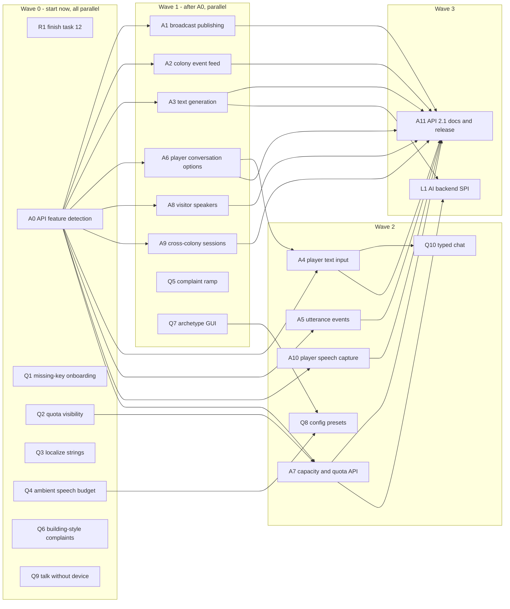

# Roadmap 2.1 — API gaps, quality of life, and addon ideas

The first roadmap (`roadmap/README.md`, tasks 01–12) delivered addon API generation 2.
This roadmap builds on it in three tracks:

| Track | File | Owner | Goal |
| --- | --- | --- | --- |
| **A — API gaps** | [api-gaps.md](api-gaps.md) | core | Close the seams that block the addon ideas below |
| **Q — Quality of life** | [qol.md](qol.md) | core | Fix the friction players and server owners hit today |
| **X — Addon ideas** | [addons.md](addons.md) | community / separate repos | Build features on the public API instead of in core |

Addons are deliberately **not** core features. Each one lists the API tasks it needs; core ships
the seam, the addon ships the gameplay. That keeps core small while still unblocking requests like
politics, newspapers, and meetings.

GitHub: every task has an issue on the
[Talking Colonists Road Map](https://github.com/users/sshcrack/projects/4) project, with
"blocked by" links matching the dependency column below and a parent tracking issue per track.

## Dependency graph

Addon dependencies (they can start against dev builds once their API tasks land; they do not need
A11 unless they want a published API artifact):

| Addon | Needs |
| --- | --- |
| X0 addon template | A0 |
| X1 Notice Board & Loudspeaker | A1, A3 (A10 for voice input, optional) |
| X2 Colony Gazette | A2, A3, A7 |
| X3 Town Hall & Elections | A1, A2, A3, A5 + Colony Meetings (external) |
| X4 Postal Service | A3 |
| X5 Tavern Recruiter | A6, A8 |
| X6 Campfire Nights | A7 (everything else exists) |
| X7 Citizen Quests | A2, A3, A5, A6 |
| X8 Diplomacy | A3, A9 |
| X9 School Lessons | A5 |
| X10 Court & Justice | A3, A5, A6 |
| X11 Tour Guide | A6 |

## Waves and concurrency

| Wave | Tasks | Can run concurrently? | Notes |
| --- | --- | --- | --- |
| 0 | R1, A0, Q1, Q2, Q3, Q4, Q6, Q9 | Yes, all | Small and independent. Q1/Q2/Q3 each touch player-facing messages; merge them one after another to avoid `en_us.json` conflicts. |
| 1 | A1, A2, A3, A6, A8, A9, Q5, Q7 | Yes, all | A1 and A2 both touch colony memory/event persistence; review together. Q5 and Q7 both touch `McTalkingConfig`; merge sequentially. |
| 2 | A4, A5, A7, A10, Q8, Q10 | Yes, except the chain A6 → A4 → Q10 | A4 and A5 both touch `GeminiWsClient`/`CitizenWsClient`; merge sequentially. |
| 3 | A11, L1 | A11 first | A11 is the 2.1 release gate. L1 is exploratory and can slip. |
| — | Q11 (#116 refactor) | Opportunistic | Never a blocker. Split `ConversationManager` only inside tasks that already touch it. |

Priority for a maintainer with little time: **Q1, Q2, Q3, Q4 → A0, A1, A3 → A2, A6**. That fixes the
most common complaints and unblocks the three most requested addons (notice board, gazette,
politics).

## Shared execution instructions

The shared instructions in [`../README.md`](../README.md#shared-execution-instructions) apply
unchanged to every task here: read `AGENTS.md`, verify dependencies are really implemented,
keep the public surface small, add deterministic tests, build both loaders, run the client smoke
test for launch-relevant changes, update `en_us.json` for config changes, and append an
implementation record to the task section when done.

Additional rules for this roadmap:

1. **API tasks (A\*)** live in `src/api` and must be backed by `internal/api` runtimes. Every new
   entry point must be feature-detectable through A0, documented in `docs/addon-api.md`, and
   compiled by an `apiTest` example for both loaders.
2. **No legacy shims** (see `AGENTS.md` — addon API compatibility policy). Additive changes only
   within 2.x; anything breaking waits for API generation 3.
3. **Addon tasks (X\*)** are specifications for separate repositories. Core must not grow the
   gameplay; if an addon needs core behaviour, add or extend an A task instead.
4. Update the task's GitHub issue and project status when starting and finishing.

## Status

The [project board](https://github.com/users/sshcrack/projects/4) is the source of truth for status;
these files are the source of truth for scope. Tracking issues: Track A #136, Track Q #137, Track X #138. #131 (local AI) is blocked by L1.

| Task | Issue | Task | Issue | Task | Issue |
| --- | --- | --- | --- | --- | --- |
| A0 | #139 | A1 | #140 | A2 | #141 |
| A3 | #142 | A4 | #143 | A5 | #144 |
| A6 | #145 | A7 | #146 | A8 | #147 |
| A9 | #148 | A10 | #149 | A11 | #150 |
| L1 | #151 | R1 | #152 | Q1 | #153 |
| Q2 | #154 | Q3 | #155 | Q4 | #133 |
| Q5 | #125 | Q6 | #54 | Q7 | #128 |
| Q8 | #156 | Q9 | #157 | Q10 | #158 |
| Q11 | #116 | X0 | #159 | X1 | #160 |
| X2 | #161 | X3 | #162 | X4 | #163 |
| X5 | #164 | X6 | #165 | X7 | #166 |
| X8 | #167 | X9 | #168 | X10 | #169 |
| X11 | #170 |   |   |   |   |
